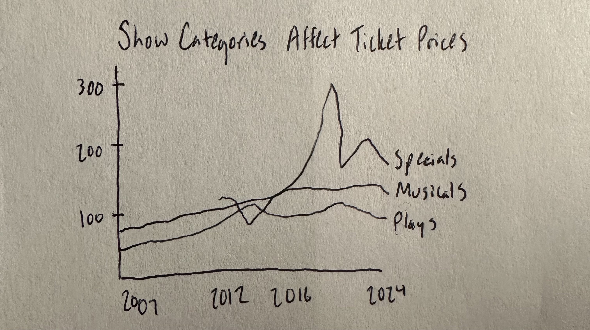
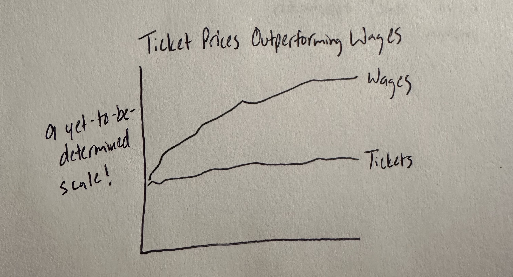

| [home page](https://cmustudent.github.io/tswd-portfolio-templates/) | [data viz examples](dataviz-examples) | [critique by design](critique-by-design) | [final project I](final-project-part-one) | [final project II](final-project-part-two) | [final project III](final-project-part-three) |

# Outline
 
My project will be focused on the ticket prices of Broadway shows in New York City and how they are becoming more expensive. Broadway attendance was at its highest right before the onset of the COVID-19 pandemic, and while attendance has almost gotten back to where it was, the ticket prices are becoming out-of-reach for many people. Particularly when compared to the national pace of inflation and wages, the audiences are becoming more and more limited. This also shows up in local and regional theatre, as evidenced by national data on attendance.

I want to dig into the changes in ticket prices for Broadway and tell the story of how we're limiting potential markets to those with higher wealth. The story I want to tell is how pricing is becoming a growing issue, and while it might help with immediate recovery from the pandemic's effects, it's not a sustainable solution if we want to continue seeing audiences return.

I will structure my project by starting with the attendance numbers themselves, which tell a positive story of building back to pre-pandemic numbers. From there, I will bring in the actual ticket pricing information, specifically broken down on numerous levels (musicals vs. plays, etc.). Then, I will show how this has not kept up with wage increases in the US and how ticket prices are greatly exceeding the speed of inflation. This is causing our audiences to buy fewer and fewer tickets, which I will evidence with a visualization from attendance data. Finally, my call to action will be that we need to find more ways to bring people into theatre, whether that's lower ticket prices or an increase in accessible pricing alternatives.

## Initial sketches

# The data

The data I am using relies heavily on Broadway statistics taken from the Broadway League. This will include the gross revenues by season, as well as attendance numbers. From here, I can calculate average ticket prices. Using more specific data from the Broadway League, I can see if there are measurable differences in musicals, plays, or other types of shows. I can then compare these numbers against increases in the national average wage index as an economic indicator of how inflation is affecting ticket prices. There may be additional data sets that can support this argument of theatre outpacing inflation in the market.

These data sources will allow me to create visualizations that show a clear upward trend in ticket prices. I also think it will be helpful to have overarching trends highlighted and then to include more data for those who wish to dig into a more granular level of detail. I will also be able to compare trend lines for ticket prices and wage increases. I think utilizing color (particularly gray) will be helpful to focus audiences' attention on what the biggest takeaways are.

| Name | URL | Description |
|------|-----|-------------|
|Broadway Season Statistics      |https://www.broadwayleague.com/research/statistics-broadway-nyc/?utm_source=chatgpt.com     |This source contains data on gross revenues and attendance numbers for 1980 - 2024.             |
|Broadway Season Statistics: 5-Season Detail      |https://www.broadwayleague.com/static/user/admin/media/statistics_broadway_2022-2023_5-season-detail.pdf     |This expands on the information provided on the Broadway League's website and provides more clarity on specific types of shows.             |
|National Average Wage Index      |https://www.ssa.gov/oact/cola/AWI.html?utm_source=chatgpt.com     |This data set shows the average wages for 1951 to 2023.             |
|Average admission at Broadway shows in New York 2022-2025, by week      |https://www-statista-com.us1.proxy.openathens.net/statistics/1286613/average-paid-admission-broadway-shows-new-york-by-week/     |This shows more specific data for the fluctuations in ticket prices by week for 2022 to the present.             |
|NEA Survey of Public Participation in the Arts      |https://www.arts.gov/sites/default/files/2022-SPPA-final.pdf     |This data demonstrates that audiences are attending theatre less frequently than even just a few years ago.             |

# Method and medium

I will primarily be relying on Shorthand and Tableau to complete my final project. The data will need a little bit of recreation in Excel, which I will then use to create my visualizations in Tableau. From there, I will design my story in Shorthand.
